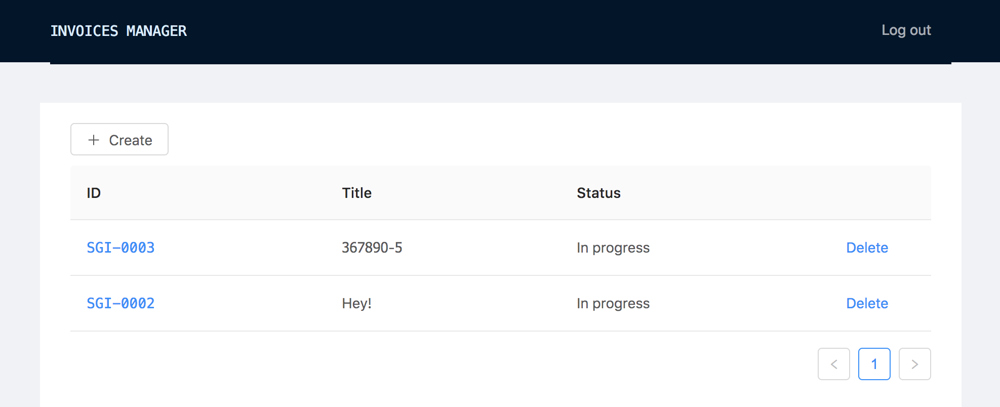

# Invoices manager

Example redux application for managing invoices.

* **[LIVE DEMO](https://wailorman.github.io/invoices-manager/#/invoices)**
(login: `root`, password: `123`)

* **[Storybook](https://wailorman.github.io/invoices-manager/storybook/?selectedKind=InvoiceList&selectedStory=basic&full=0&addons=1&stories=1&panelRight=0&addonPanel=storybook%2Factions%2Factions-panel)**

## Usage

### `yarn`

Install dependencies

### `yarn start`

Start dev server → `root:123`

### `yarn storybook`

Start storybook
